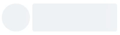

# tiny-skeleton-loader-react

zero dependency, ultra lightweight (1KB gzipped) skeleton loader component for react ✨




## 🔧 Installation

```bash
npm install --save tiny-skeleton-loader-react
```

## 📦 Usage

```tsx
import React from "react";

import SkeletonLoader from "tiny-skeleton-loader-react";

class Example extends React.Component {
  render() {
    return <SkeletonLoader />;
  }
}
```

## 👀 Properties

| Property       | Attribute       | Description             | Type      | Default     |
|----------------|-----------------|-------------------------|-----------|-------------|
| `width`        | `width`         | Loader Width            | `string`  | `"100%"`    |
| `height`       | `height`        | Loader Height           | `string`  | `"1em"`     |
| `background`   | `background`    | Loader background color | `string`  | `"#eff1f6"` |
| `circle`       | `circle`        | Make Skeleton Circle    | `boolean` | `false`     |
| `borderRadius` | `border-radius` | Loader radius           | `string`  | `"4px"`     |
| `block`        | `block`         | Whether to start new    | `boolean` | `true`      |
| `style`        | `style`         | Extra Styles            | `object`  | `{}`        |
| `as`           | --              | The HTML element        | `string`  | `"div"`     |

## License

MIT © [hc-oss](https://github.com/hc-oss)
